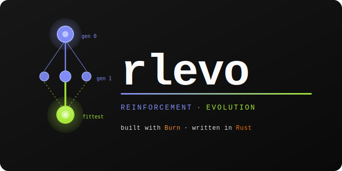

# rlevo



**Survival of the fittest, implemented in Rust.**

Gradient descent is powerful, but it is a local optimizer. If an agent finds a mediocre solution that is "good enough," it often gets trapped in a local optimum — a mathematical rut that no amount of hyperparameter tuning can escape.

`rlevo` takes a different path. Built on [Burn](https://burn.dev/), this library implements **Deep Reinforcement Learning with Evolutionary Optimization**: a population-based approach that uses crossover, mutation, and natural selection to optimize neural networks across complex, non-convex search spaces.

## Why Evolutionary Optimization with Deep Reinforcement Learning?

| Feature | Standard RL (Gradient-Based) | Evolutionary RL (ERL) |
| :--- | :--- | :--- |
| **Optimization** | Gradient descent | Black-box / genetic operators |
| **Agent focus** | Individual policy refinement | Population-wide evolution |
| **Learning signal** | Step-level rewards (TD-learning) | Episodic fitness (total reward) |
| **Search space** | Susceptible to local optima | Robust to noise & non-convexity |
| **Scaling** | Complex distributed synchronization | Embarrassingly parallel |
| **Sample efficiency** | High | Low (offset by parallelism) |

Because evaluating individuals is independent, ERL maps naturally onto Rust's fearless concurrency and Burn's backend-agnostic tensor operations — turning the sample-efficiency trade-off into a raw-throughput advantage.

## Why `rlevo`?

The ERL research community has produced a rich ecosystem of Python implementations, many optimized for rapid experimentation with flat vector observations and fixed-dimension action spaces. `rlevo` builds on those foundations while exploring a different set of design priorities, rooted in Rust:

**Const-generic dimensional safety.** `State<SR>`, `Observation<R>`, and `Action<AR>` carry their dimensionality as const generic parameters. Dimension mismatches are compile-time errors, not runtime panics — to our knowledge, a guarantee no other Rust RL crate currently offers at the type level.

**Shared abstractions for evolutionary and gradient-based RL.** Evolutionary and gradient-based agents implement the same `rlevo::core` traits and run against identical environments. Hybrid algorithms that interleave the two — the evolution-guided injection loop pioneered by [Khadka & Tumer (2018)](https://arxiv.org/abs/1805.07917) and extended by work like [EvoRainbow](https://github.com/yeshenpy/EvoRainbow) (ICML 2024) — are in active design in `rlevo-hybrid`. JAX-based libraries such as [EvoRL](https://github.com/EMI-Group/evorl) already ship implemented hybrids; `rlevo` aims to bring that pairing to a type-safe Rust stack.

**Backend-agnostic tensors via Burn.** Neural network weights, population tensors, and replay buffers are all Burn tensors. Hardware backends (CPU, WGPU, CUDA) swap without touching algorithm code.

**Reproducible, structured run records.** Every run can emit a typed, versioned `EpisodeRecord` with full provenance (algorithm, versions, git SHA, device, seeds), replayable in a self-contained static-HTML report — built for reproducible experiments and shareable results.

## What's Included

### Environments

**Classic Control**
- `CartPole` — balance a pole on a moving cart
- `MountainCar` / `MountainCarContinuous` — escape a valley with sparse rewards
- `Pendulum` — swing-up and stabilization
- `Acrobot` — underactuated double pendulum
- `TenArmedBandit` — multi-armed bandit testbed

**Box2D Physics**
- `BipedalWalker` — bipedal locomotion over varied terrain
- `LunarLanderDiscrete` / `LunarLanderContinuous` — fuel-efficient touchdown
- `CarRacing` — top-down racing with visual observations

**MuJoCo-style Locomotion**
- `InvertedPendulum` / `InvertedDoublePendulum` — balance tasks
- `Reacher` — goal-reaching with a two-link arm
- `Swimmer` — fluid locomotion with drag dynamics

**Grid Worlds**
- Configurable grid environments with optional memory, keyed doors, and partial observability

### Deep RL Algorithms

**Value-Based**
- **DQN** — Deep Q-Network with experience replay and target network
- **C51** — Categorical DQN (distributional RL over 51 atoms)
- **QR-DQN** — Quantile Regression DQN

**Policy Gradient**
- **PPO** — Proximal Policy Optimization with clipped surrogate objective (categorical and Gaussian policies)
- **PPG** — Phasic Policy Gradient with auxiliary phase and distillation

**Actor-Critic (Continuous Control)**
- **DDPG** — Deep Deterministic Policy Gradient with Ornstein-Uhlenbeck exploration
- **TD3** — Twin Delayed DDPG with target policy smoothing
- **SAC** — Soft Actor-Critic with automatic entropy tuning

### Evolutionary & Swarm Algorithms

**Classical Algorithms**
- Genetic Algorithm (GA) with crossover and mutation operators
- Evolution Strategies (ES), Evolutionary Programming (EP)
- Differential Evolution (DE), Cartesian Genetic Programming (CGP)

**Swarm Intelligence**
- Particle Swarm Optimization (PSO)
- Ant Colony Optimization (ACO)
- Firefly, Cuckoo Search, Bat Algorithm
- Grey Wolf Optimizer (GWO), Artificial Bee Colony (ABC)
- Whale Optimization Algorithm (WOA), Salp Swarm

### Hybrid RL + Evolution

Hybrid training strategies that combine gradient-based RL with evolutionary search are in active design. See the roadmap for details.

## Quick Start

```toml
[dependencies]
rlevo = "0.1"
```

```rust
use rlevo::prelude::*;
use rlevo::envs::classic::{CartPole, CartPoleAction, CartPoleConfig};

fn main() -> Result<(), Box<dyn std::error::Error>> {
    let mut env = CartPole::with_config(CartPoleConfig::default());
    let snapshot = env.reset()?;
    println!("Initial observation: {:?}", snapshot.observation());

    loop {
        // Replace with your policy — here we sample a random action
        let action = CartPoleAction::random();
        let snapshot = env.step(action)?;

        if matches!(snapshot.status(), EpisodeStatus::Terminated | EpisodeStatus::Truncated) {
            break;
        }
    }
    Ok(())
}
```

```bash
# Build the workspace
cargo build

# Run tests
cargo test --workspace

# Generate documentation
cargo doc --workspace --no-deps --open
```

## Development Status

`rlevo` is **alpha software**. The core trait API is largely settled; algorithm implementations and environments are under active development. Breaking changes may occur before 1.0.

| Area | Status |
| :--- | :--- |
| Core trait API | Stable |
| Environments (13+) | Active |
| Deep RL algorithms (8) | Active |
| Evolutionary & swarm algorithms | Active |
| Benchmarking harness | Active |
| Hybrid RL + evolution | Early design |

## Dependencies

- **[Burn](https://burn.dev/) 0.21** — backend-agnostic tensor operations; features: `wgpu`, `train`, `tui`, `metrics`, `flex`
- **cubecl 0.10** — compute abstraction layer underlying Burn's wgpu backend
- **rand 0.10** — randomness and deterministic seeding
- **rand_distr 0.6** — probability distributions (normal, uniform, etc.)
- **ringbuffer 0.16** — fixed-capacity circular buffer for replay buffers
- **serde 1.0** — serialization for checkpoints and configs
- **tracing 0.1** — structured logging
- **tracing-subscriber 0.3** — subscriber implementations
- **thiserror 2.0** — typed error enums
- **anyhow 1.0** — ergonomic error propagation for application-level code
- **rapier2d / rapier3d 0.32** — physics simulation with enhanced determinism
- **parking_lot 0.12** — high-performance Mutex/RwLock
- **criterion 0.8** — statistical microbenchmarking
- **pprof 0.15** — CPU profiling with flamegraph and criterion integration
- **approx 0.5** — floating-point approximate equality for tests

## Prior Work and Acknowledgements

`rlevo` stands on the shoulders of a large body of research and open-source work. The evolutionary-RL field is rich and active, and several projects directly shaped this library's design:

- **[Evolution-Guided Policy Gradient in Reinforcement Learning](https://arxiv.org/abs/1805.07917)** (Khadka & Tumer, NeurIPS 2018) and its [reference implementation](https://github.com/ShawK91/Evolutionary-Reinforcement-Learning) — the canonical ERL injection loop that `rlevo-hybrid` is built around.
- **[EvoRainbow](https://github.com/yeshenpy/EvoRainbow)** (Li et al., ICML 2024) — demonstrated that pairing distributional RL with evolutionary search is empirically strong; a direct motivator for combining `rlevo`'s C51/QR-DQN with its evolutionary algorithms.
- **[EvoRL](https://github.com/EMI-Group/evorl)** (EMI-Group) — its JAX population-as-tensor evaluation pattern is the architectural target for batched, single-kernel population evaluation in `rlevo-evolution`, and its implemented hybrid algorithms are a valuable reference.
- **[Evolutionary Constrained Reinforcement Learning](https://github.com/HcPlu/Evolutionary-Constrained-Reinforcement-Learning)** (Hu et al.) — informs the constraint-aware directions on the roadmap.
- **[EvoJAX](https://github.com/google/evojax)** and **[evosax](https://github.com/RobertTLange/evosax)** — references for hardware-accelerated neuroevolution and evolution-strategy API design.
- **[CleanRL](https://docs.cleanrl.dev/)** — clear, single-file algorithm references that guided several deep-RL implementations.
- **[Gymnasium](https://gymnasium.farama.org/)** (Farama Foundation) — the environment specifications that `rlevo`'s classic-control, Box2D, and MuJoCo-style environments follow.
- **[Burn](https://burn.dev/)** (Tracel AI) — the backend-agnostic tensor and deep-learning framework that makes the whole library possible.

Any mischaracterization of these projects is ours alone; corrections are welcome. If your work belongs here and isn't credited, please open an issue or PR.

## Contributing

See [CONTRIBUTING.md](CONTRIBUTING.md) for guidelines, scope, and how to open a PR.

## Ethics and Security

`rlevo` is training infrastructure — the objectives you encode and the policies you deploy carry real consequences. See [ETHICS_AND_AI.md](ETHICS_AND_AI.md) for our commitments around reward function transparency, emergent behavior, and responsible distribution of trained policies.

To report a security vulnerability privately, see [SECURITY.md](SECURITY.md).

## Development

This crate was developed with the assistance of AI coding tools (Claude by Anthropic).

## License

Licensed under either of [Apache License, Version 2.0](LICENSE-APACHE) or [MIT License](LICENSE-MIT) at your option.
