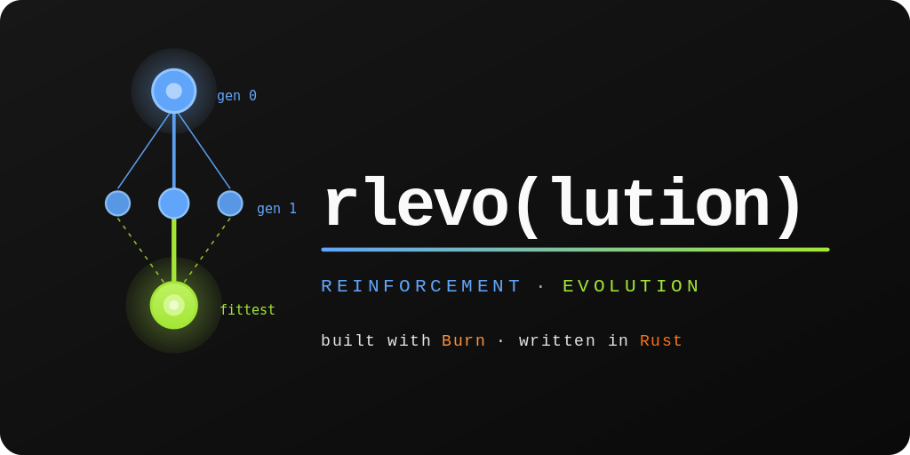

# rlevo-examples



Runnable, application-tier examples for the [`rlevo`](../rlevo/) library:
benchmarking-harness demos, a live training dashboard, and post-run HTML
reports with interactive environment playback.

This is a **leaf crate** — nothing in the `rlevo` library depends on it. It
exists so heavyweight examples that pull in the benchmarking/visualisation
stack live in one place, isolated from the lean library crates (ADR 0012).

## What belongs here vs. in `rlevo/examples/`

| Example uses…                                                                 | Lives in                  |
| ----------------------------------------------------------------------------- | ------------------------- |
| `rlevo-benchmarks` (harness, suites, recording, reporting, TUI)               | **`rlevo-examples`** (here) |
| only the library crates (`rlevo-core`, `-environments`, `-evolution`, `-reinforcement-learning`, `-hybrid`) | [`rlevo/examples/`](../rlevo/examples/) |

## Running examples

`rlevo-examples` is excluded from the workspace `default-members`, so a bare
`cargo build` skips it. Address it explicitly with `-p rlevo-examples`, and
**run from the repository root** (the report emitter resolves the WASM client
assets at the relative path `crates/rlevo-benchmarks-report-client/dist`):

```bash
cargo run -p rlevo-examples --example <name> [--features <flags>] [--release]
```

Each example's source file opens with a doc comment explaining what it builds
and which report/TUI panels it lights up — read it alongside the entry below.

## Example catalog

### Benchmarking harness — no features required

These run the `Suite` → `Evaluator::run_suite` → `BenchmarkReport` path and
print results to stdout. The quickest way to see the harness in action.

| Example          | What it demonstrates                                                                                          | Run                                                  |
| ---------------- | ------------------------------------------------------------------------------------------------------------ | ---------------------------------------------------- |
| `tabular_bandit` | An ε-greedy sample-average agent on `TenArmedBandit`; prints per-trial `return/mean` across the seed sweep.   | `cargo run -p rlevo-examples --example tabular_bandit` |
| `ga_rastrigin`   | A hand-rolled GA on the Rastrigin landscape; exercises the `FitnessEvaluable` + `BenchEnv` harness contracts. | `cargo run -p rlevo-examples --example ga_rastrigin`   |

### Evolutionary algorithms — no features required

Standalone demos of algorithm families not covered by the harness examples above.

| Example                      | What it demonstrates                                                          | Run                                                                |
| ----------------------------- | ------------------------------------------------------------------------------ | ------------------------------------------------------------------- |
| `eda_showcase`                | Estimation-of-Distribution model variants (Gaussian/Bernoulli/compact-GA/dependency-chain/Bayesian network) on a shared landscape. | `cargo run -p rlevo-examples --example eda_showcase`                |
| `competitive_predator_prey`   | Competitive coevolution (`CompetitiveCoEA`) between two adversarial populations. | `cargo run -p rlevo-examples --example competitive_predator_prey`   |
| `cooperative_ccga_rastrigin`  | Cooperative coevolution (`CooperativeCoEA`) decomposing Rastrigin across two subpopulations. | `cargo run -p rlevo-examples --example cooperative_ccga_rastrigin`  |
| `santa_fe_ant_deterministic`  | `WeightOnly` neuroevolution of a memoryless policy on the deterministic Santa Fe Trail. | `cargo run -p rlevo-examples --example santa_fe_ant_deterministic`  |
| `santa_fe_ant_stochastic`     | Recurrent-memory neuroevolution on a stochastic variant of the Santa Fe Trail. | `cargo run -p rlevo-examples --example santa_fe_ant_stochastic`     |

### Book examples — no features required

Compiled, test-guarded examples pulled into the user-book via
`{{#rustdoc_include}}`; each mirrors a specific book chapter.

| Example                   | Chapter                                    | Run                                                          |
| -------------------------- | ------------------------------------------- | -------------------------------------------------------------- |
| `ch00_grid_agent`          | Ch. 0 — a minimal grid `Environment`/`Action` implementation | `cargo run -p rlevo-examples --example ch00_grid_agent`          |
| `ch00_state_constraints`   | Ch. 0 — `State`/`Observation` constraints    | `cargo run -p rlevo-examples --example ch00_state_constraints`   |
| `ch01_sphere_ga`           | Ch. 1 — real-valued GA on the Sphere landscape | `cargo run -p rlevo-examples --example ch01_sphere_ga`           |
| `ch03_dqn_cartpole`        | Ch. 3 — DQN on CartPole                      | `cargo run -p rlevo-examples --example ch03_dqn_cartpole`        |

### Live TUI — `--features viz-tui`

The live product (ADR 0013): a metrics-only `ratatui` dashboard that answers
*"is it learning?"* from streaming sparklines. No environment is rendered —
env playback is the report tier's job.

| Example            | What it demonstrates                                                                                                       | Run                                                                                  |
| ------------------ | ------------------------------------------------------------------------------------------------------------------------- | ------------------------------------------------------------------------------------ |
| `tui_ppo_cartpole` | A live dashboard wrapping a PPO-on-`CartPole` training loop; reward + loss sparklines climb as PPO learns. Use `--release`. | `cargo run -p rlevo-examples --example tui_ppo_cartpole --features viz-tui --release` |

### Post-run reports — `--features viz-report`

The post-run product (ADR 0013): training is recorded to disk, then emitted as
a single self-contained `index.html` that mounts the Leptos/WASM report client.
Each example targets a different environment family so you can see every
playback adapter. See [the report workflow](#report-workflow) below for the
one-time client build step.

| Example                                 | Family / adapter                                            | Extra features        |
| --------------------------------------- | ---------------------------------------------------------- | --------------------- |
| `report_ppo_cartpole_with_client`       | Classic control — RL convergence plots + Classic2D playback | —                     |
| `report_sphere_landscape_with_client`   | Landscapes — search-space trail + candidate/best markers    | —                     |
| `report_grids_with_client`              | Grids — Minigrid-style tile playback (`EmptyEnv`)           | —                     |
| `report_toy_text_with_client`           | Toy-text — tabular tile playback (`FrozenLake`)             | —                     |
| `report_inverted_pendulum_with_client`  | Locomotion — sagittal-plane stick-figure SVG                | `locomotion`          |
| `report_lunar_lander_with_client`       | Box2D — rigid-body polygon SVG (`LunarLanderDiscrete`)      | `box2d`               |

## Report workflow

The `*_with_client` examples inline a pre-built WASM client into the emitted
HTML — there is **no server and nothing streams**. The flow is two steps:

```bash
# 1) One-time per client code change: build the WASM bundle into `dist/`.
#    Requires the wasm target + trunk:
#      rustup target add wasm32-unknown-unknown
#      cargo install trunk
cd crates/rlevo-benchmarks-report-client
trunk build --release
cd ../..   # back to the repository root

# 2) Run a report example. It trains, records frames + metrics to a run
#    directory, then inlines `dist/` into a single-file index.html.
cargo run -p rlevo-examples --example report_ppo_cartpole_with_client \
    --features viz-report --release
```

The example prints the path of the emitted file (e.g.
`…/<run-dir>/index.html`) along with the episode count and byte size; open
that file in any browser. `--release` matters for the RL examples — PPO is
unusably slow in debug builds.

Family-specific examples need their environment feature alongside `viz-report`:

```bash
cargo run -p rlevo-examples --example report_inverted_pendulum_with_client \
    --features locomotion,viz-report --release
cargo run -p rlevo-examples --example report_lunar_lander_with_client \
    --features box2d,viz-report --release
```

## Example layout

```
examples/
  common/       shared PPO-on-CartPole model/config, included by the cartpole examples
  harness/      benchmarking-harness demos      (tabular_bandit, ga_rastrigin)
  book/         user-book chapter examples      (ch00_grid_agent, ch00_state_constraints, ch01_sphere_ga, ch03_dqn_cartpole)
  classic/      PPO on CartPole                 (tui_ppo_cartpole, report_ppo_cartpole_with_client)
  evolution/    landscape report + standalone algorithm demos
                (report_sphere_landscape_with_client, eda_showcase,
                 competitive_predator_prey, cooperative_ccga_rastrigin,
                 santa_fe_ant_deterministic, santa_fe_ant_stochastic)
  grids/        grid environments report         (report_grids_with_client)
  toy_text/     toy-text environments report     (report_toy_text_with_client)
  locomotion/   inverted pendulum report         (report_inverted_pendulum_with_client)
  box2d/        lunar lander report              (report_lunar_lander_with_client)
```

`common/ppo_cartpole.rs` is shared scaffolding (model, config, training loop)
pulled in via `#[path = …] mod` by the cartpole examples — it is not a
standalone target. Likewise `evolution/santa_fe_ant_support.rs` is shared
scaffolding pulled in by `santa_fe_ant_deterministic` and
`santa_fe_ant_stochastic`.

## Features

| Feature      | Enables                                                                                                              |
| ------------ | ------------------------------------------------------------------------------------------------------------------- |
| `viz-tui`    | Live metrics TUI dashboard (`rlevo-benchmarks/tui`).                                                                 |
| `viz-report` | Post-run recording + static-HTML report (`rlevo-benchmarks/report`, which pulls `record` transitively, plus `rlevo-environments/record` for the per-family `RecordedEnvFamily` impls). |
| `locomotion` | Rapier3D locomotion environments (`rlevo-environments/locomotion`).                                                  |
| `box2d`      | Rapier2D Box2D-style environments (`rlevo-environments/box2d`).                                                      |

There is no separate `viz-record` flag — `viz-report` is the single post-run
product and carries recording transitively (ADR 0013 §5).

## License

Licensed under either of [Apache License, Version 2.0](../../LICENSE-APACHE) or [MIT License](../../LICENSE-MIT) at your option.
